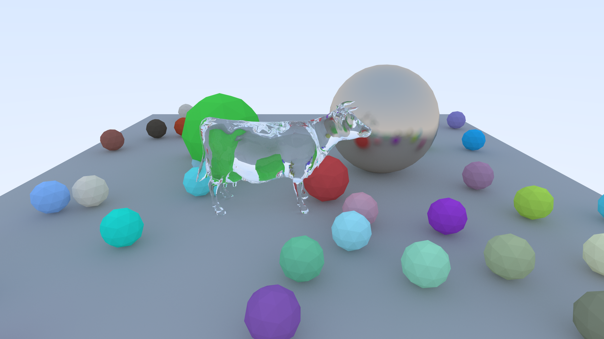

# Renderer
My own implementation of [Ray Tracing in One Weekend](https://raytracing.github.io/books/RayTracingInOneWeekend.html).



## Differences with the original tutorial
* Works on triangle meshes instead of only spheres
* Uses glm for 3D math

## Build on Linux
```bash
$ mkdir build
$ cd build
$ cmake -DCMAKE_BUILD_TYPE=Release ..
$ make -j4
```

## Run on Linux
```bash
$ ./Renderer/Renderer
# To run on a single NUMA node
$ numactl --cpunodebind=0 --membind=0 Renderer/Renderer
# To run on a two sockets computer
$ mpirun -n 2 --map-by socket --mca btl self,vader RendererMPI/RendererMPI
```

## Author
Mathieu Gaillard
[CGVLab](https://www.cs.purdue.edu/cgvlab/www/)  
Department of Computer Science
Purdue University

## License
See the LICENSE file.
